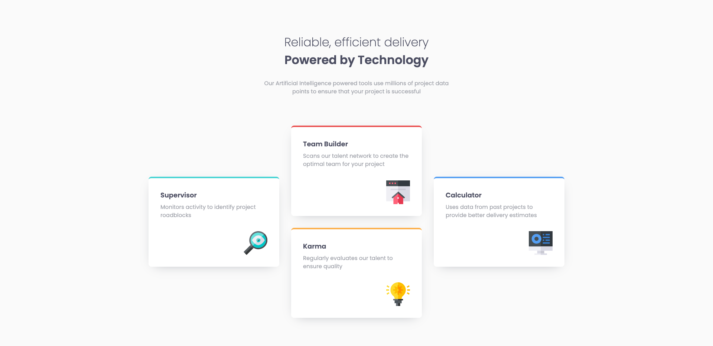

# Frontend Mentor - Four card feature section solution

This is a solution to the [Four card feature section challenge on Frontend Mentor](https://www.frontendmentor.io/challenges/four-card-feature-section-weK1eFYK). Frontend Mentor challenges help you improve your coding skills by building realistic projects. 

## Table of contents

- [Overview](#overview)
  - [The challenge](#the-challenge)
  - [Screenshot](#screenshot)
  - [Links](#links)
- [My process](#my-process)
  - [Built with](#built-with)
  - [What I learned](#what-i-learned)
  - [Continued development](#continued-development)
- [Author](#author)

## Overview

### The challenge

Users should be able to:

- View the optimal layout for the site depending on their device's screen size

### Screenshot

### Links

- Solution URL: [github.com/jyeharry/four-card-feature-section](https://github.com/jyeharry/four-card-feature-section)
- Live Site URL: [https://jyeharry.github.io/four-card-feature-section](https://jyeharry.github.io/four-card-feature-section)

## My process

### Built with

- Semantic HTML5 markup
- CSS custom properties
- Flexbox
- CSS Grid
- Mobile-first workflow

### What I learned

Refreshed my memory on CSS Grid. It was a little tricky getting it right. I wanted to try to make the columns responsive without breakpoints but learnt that when your grid items are using `grid-row` and `grid-column`, the trick with using `repeat(auto-fit, ...)` doesn't work. I'm satisfied with my result but would like to know if there is a better way to do it.

### Continued development

I'd like to master grid so that I can create layouts whose CSS is easy to read and understand, ideally without too many media queries because I feel as though this is where things can start to get messy when you have lots of them.

## Author

- Website - [Jye Harry](https://jyeharry.github.io)
- Frontend Mentor - [@jyeharry](https://www.frontendmentor.io/profile/jyeharry)

